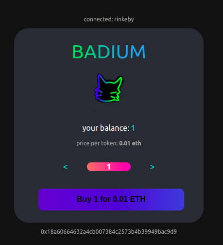

# Radium Buy Page 

## Functions 
Allows the general public (anyone) to: 
- Connect using any standard ethereum browser wallet 
- View connected wallet's balance of Radium token in real time 
- Purchase any number of Radium token 

## Testing 
- manual testing on testnet
- with metamask 
- on Chrome and Brave

## Development 
- Nodejs 16.4.0 
- Typescript 
- React (create-react-app) 
- ethersjs
- (on ubuntu 20.0.4) 

