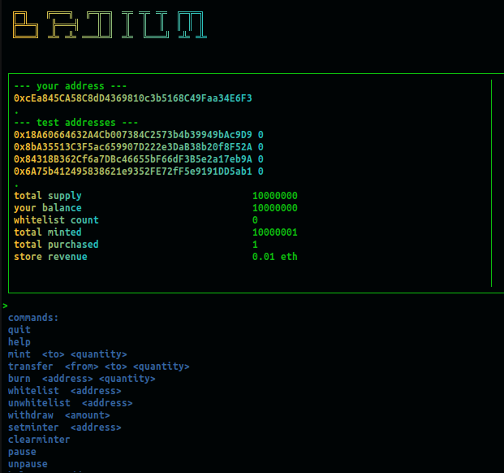

# Radmin CLI 

## Functions 
Allows the contract owner to: 
- view total supply and balances 
- mint new tokens 
- manage whitelist (add/remove/query) 
- transfer tokens from anyone to anyone 
- burn any tokens 
- burn all tokens
- view MintStore revenue 
- withdraw funds from MintStore 
- pause/unpause the Radium contract 
- set or remove a 'designated minter' for Radium token (i.e. MintStore)

## Testing 
- manual testing on testnet 

## Development 
- Nodejs 16.4.0 
- Ink-cli and React 
- ethersjs
- (on ubuntu 20.0.4) 

I had never used this library (ink-cli) before, but I've been wanting to try it. It's pretty interesting. It uses React to build a _console_ application. I didn't have enough time to explore it fully, and the way I'm using it here - while it's working just fine - is probably not really ideal architecture; it was nice to get to work with it though. I need some more time to work with it. It's a great tool for someone who likes console apps. 

[ink-cli on github](https://github.com/vadimdemedes/ink) 
