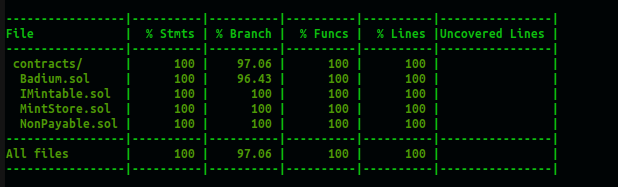

# Radium (RAD) ERC20 Token 

## Functions 
- Standard ERC20 interface (balanceOf, transfer, approve, etc) 
- Contract is Ownable - it has a single owner (by default contract creator) 
- Contract is Pausable - contract owner can pause all activity or unpause it at any time
- Contract owner may burn every token in existence in one single call (doesn't use iteration)
- Contract owner may burn any number of any holder's specific tokens 
- Contract owner may transfer anyone's tokens to anyone else, as long as the receiver is whitelisted (contract owner has implicit approval as spender for all tokens) 
- Contract maintains a whitelist - only users on the whitelist may receive tokens in a transfer (with the exception of minting) 
- Contract owner may add or remove addresses to whitelist 
- Anyone has permission to query whitelist 
- Only contract owner or a specific designated contract has permission to mint 
- Specific designated minting contract may be set to MintStore, which 'sells' tokens to anyone (buyers need not be whitelisted) 
- Any buyer of tokens from the MintStore may not transfer tokens to any non-whitelisted address
- Implications: contract owner may steal, give away, or burn your tokens at any time. It's very deflationary. 

## Testing 
- [standard javascript unit tests](test-reports/coverage-report.md) (97% coverage) 
- [slither](test-reports/slither-report.md) (analyzer)
- [mythril](test-reports/mythril-radium.md) (static analysis)

[SEE FULL RESULTS HERE](test-reports/)

## Development 
- Solidity 0.8.4, rinkeby network 
- OpenZeppelin
- Hardhat 2.11.1 
- Nodejs 16.4.0 (scripts and unit tests) 
- ethersjs
- (on ubuntu 20.0.4) 

## Architecture 

### OpenZeppelin
OpenZeppelin was used for utilities like Ownable, Pausable, IERC20, etc. Originally, OZ's ERC20 contract was used, but was later merged into the Radium contract itself. The reason for the merge was that in order to efficiently implementing the burnAll method, it was not possible without modifying the code of the core ERC20.sol contract. Since that was necessary, I just decided to merge the code into one contract, and remove anything that I didn't need (to simplify the contract). The resulting contract seems 'big' to look at, but is actually a smaller (and less expensive) codebase than if I had inherited OZ's ERC20. 

### BurnAll 
It is tempting at first to imagine doing burnAll using iteration over an array, but I really wanted to avoid that, as it doesn't scale at all. I got the idea of just setting a flag or a counter, such that 'burning' simply ignores all existing balances, sets the totalSupply to zero, and continues on from there. All previous balances still are stored in memory; nothing is erased. The memory space is large enough that running out of memory is not a practical concern. Running out of gas doing iterations, on the other hand, is a very real and tangible probability. 

BurnAll does the following: 
- increments the epoch 
- sets totalSupply to zero 
- eradicates all balances 
- eradicates all approvals 

In the code for [Radium.sol](contracts/Radium.sol), see the _epoch_ field. Incrementing this (by calling the _burnAll_ function) allows the contract to move to the next 'level' in the balances and allowances mappings, essentially ignoring all current balances and allowances and starting over.  

### Owner Transfer 
The requirement for the contract owner to be able to transfer anyone's tokens to anyone else, was done by implicitly allowing the contract owner to be an approved spender for everyone and anyone's tokens. In the 'allowance' function, there is a clause that returns true automatically if the address is the contract owner's. 

The implication of this is that the owner is designated spender for everyone's coins, automatically, without having to be granted. 

There is a restriction, though, that even the owner can't transfer to a non-whitelisted address. There are a number of easy ways that this could be allowed. For example, transfer by owner could come with an automatic 'add to whitelist'. Or another private parameter could be added such that if the transferrer is the owner, just ignore the whitelist. It wasn't specified in the requirements though, so I just left it this way. The owner can easily just add an address to whitelist manually, if needed. 

### Owner Burn 
Because the owner has implicit 'spender' status for everyone's tokens, burning is automatically allowed as well. So the contract owner can automatically burn anyone's tokens. I added an extra function, burn(address, uint) to allow it. 

### Whitelist 
The whitelist is just implemented as a map in the contract. There is a case to be made for decoupling it, but while it would bring some benefit to do so there would also be a good deal of overhead involved. The whitelist is coded into the ERC20 itself, I think it makes good sense for it to be there. 

### MintStore 
The functionality for _selling_ the token is decoupled from the token itself. I usually think it's a good tradeoff (in real life) to decouple the commerce aspect of the token from the token logic, so that the commerce aspect can vary independently without disturbing the core token, and _without_ need for an upgradeable token (which I feel is just fundamentally a bad idea, in general). So to demonstrate a more lifelike scenario, even though it was not part of the requirements, I did what I would normally do and decoupled the selling from the logic. 

The MintStore knows the address of the token (it knows it as an IMintable), and the token contract gives special permission to the MintStore to call the _mint_ function. Only the MintStore and the contract owner may call the _mint_ function. The token contract owner may revoke the minting permission from the MintStore, by calling _setDesignatedMinter_ or _clearDesignatedMinter_. The token contract owner may be the same as the MintStore contract owner, but they don't necessarily need to be the same. The owner of the MintStore contract (only) has permission to withdraw funds accumulated from sales. 
