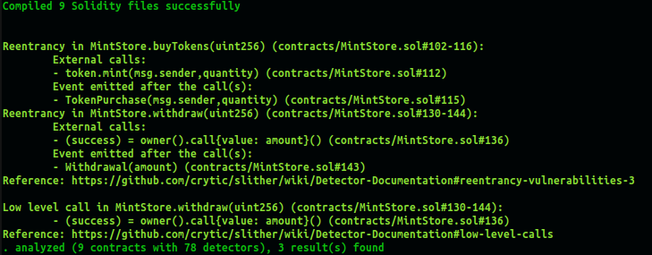

# Slither 

 

### Issue 1: Reentrancy Risk
```
Reentrancy in MintStore.buyTokens(uint256) (contracts/MintStore.sol#102-116):
	External calls:
	- token.mint(msg.sender,quantity) (contracts/MintStore.sol#112)
	Event emitted after the call(s):
	- TokenPurchase(msg.sender,quantity) (contracts/MintStore.sol#115)
```
#### NON-ISSUE: 
- the token contract is trusted 
- the method follows checks-effects-interactions 
- there is no state-changing code after the interaction; only an event emit 
- safe practices are observed; there is no real risk of reentrancy attack 

### Issue 2: Reentrancy Risk
```
Reentrancy in MintStore.withdraw(uint256) (contracts/MintStore.sol#130-144):
	External calls:
	- (success) = owner().call{value: amount}() (contracts/MintStore.sol#136)
	Event emitted after the call(s):
	- Withdrawal(amount) (contracts/MintStore.sol#143)
Reference: https://github.com/crytic/slither/wiki/Detector-Documentation#reentrancy-vulnerabilities-3
```
#### NON-ISSUE: 
- the token contract is trusted 
- the method follows checks-effects-interactions 
- there is no state-changing code after the interaction; only an event emit 
- any caller of the contract already has access to the contract's funds 
- safe practices are observed; there is no real risk of reentrancy attack 

### Issue 3: Low Level Call
```
Low level call in MintStore.withdraw(uint256) (contracts/MintStore.sol#130-144):
	- (success) = owner().call{value: amount}() (contracts/MintStore.sol#136)
Reference: https://github.com/crytic/slither/wiki/Detector-Documentation#low-level-calls
```
#### ACKNOWLEDGED: 
- address.call is currently (2022) the recommended way to send ether from contract to an address
- the low-level call return value is used to revert the transaction if failed 
- checks-effects-interactions is observed 
- best practices are observed
